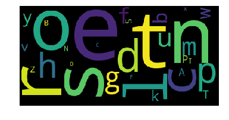

# word-cloud
This program creates a "word cloud" from text. This script processes the text, removes punctuation, ignores case and words that do not contain all alphabets, counts the frequencies, and ignores uninteresting or irrelevant words. A dictionary is the output of the **calculate_frequencies** function. The **wordcloud** module will then generate the image from the dictionary.

